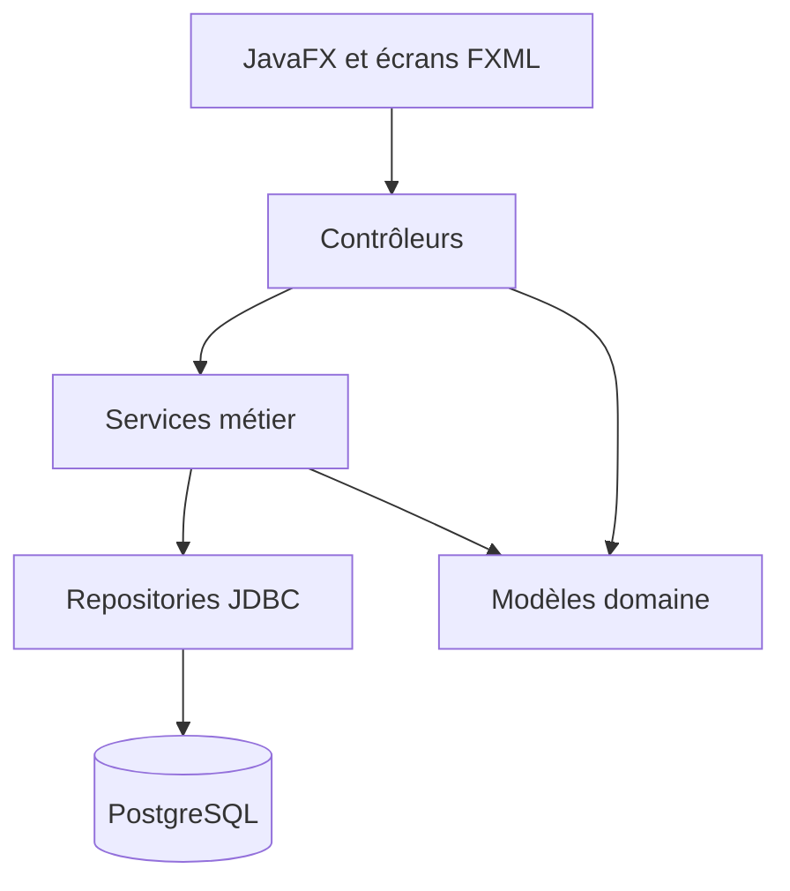
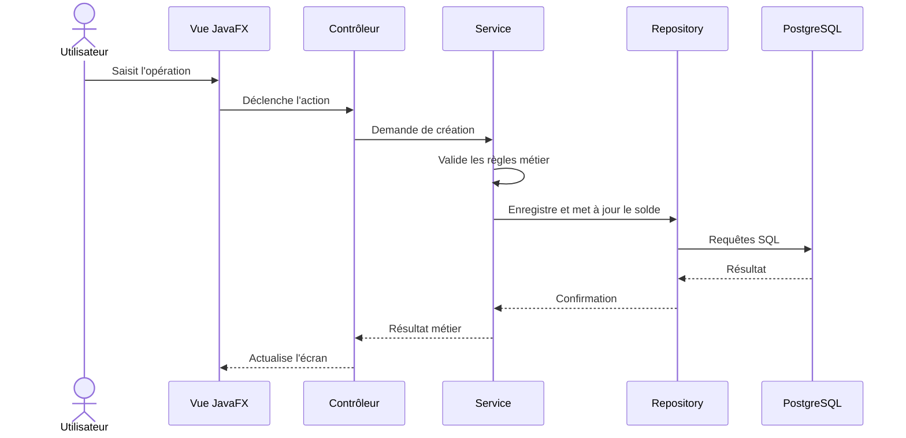

# MicroGest

MicroGest est une application de bureau JavaFX destinée à la gestion d'un établissement de microfinance. Elle centralise les adhérents, les agences, les comptes d'épargne, les opérations financières et le suivi des prêts.

## Sommaire

- [Présentation](#présentation)
- [Fonctionnalités](#fonctionnalités)
- [Technologies et dépendances](#technologies-et-dépendances)
- [Prérequis](#prérequis)
- [Installation](#installation)
- [Configuration](#configuration)
- [Lancement](#lancement)
- [Tests](#tests)
- [Architecture](#architecture)
- [Rôles et accès](#rôles-et-accès)
- [Structure du projet](#structure-du-projet)

## Présentation

| Élément | Valeur |
| --- | --- |
| Type | Application desktop |
| Langage | Java 21 |
| Interface | JavaFX 21.0.6 et FXML |
| Base de données | PostgreSQL |
| Accès aux données | JDBC et repositories |
| ORM disponible | Hibernate ORM et Jakarta Persistence |
| Build | Apache Maven et Maven Wrapper |
| Tests | JUnit Jupiter 5.12.1 |
| Identifiant Maven | `isi.diti3:micoGuest:1.0-SNAPSHOT` |

## Fonctionnalités

### Authentification et utilisateurs

- Connexion par nom d'utilisateur et mot de passe haché avec BCrypt.
- Gestion des utilisateurs par l'administrateur.
- Création, modification et suppression d'utilisateurs.
- Activation, désactivation et blocage des comptes.
- Attribution des rôles `ADMIN`, `AGENT` et `SUPERVISEUR`.
- Contrôle des accès selon le rôle connecté.
  -mot de passe pour l'utilisateur:
  -admin-->P@sser123
  -superviseur-->P@sser123
  -agent1-->P@sser123

### Adhérents

- Création, modification et suppression d'un adhérent.
- Gestion du nom, prénom, téléphone, e-mail, adresse, dates et agence.
- Gestion des statuts `ACTIF`, `SUSPENDU` et `FERME`.
- Recherche, filtre par statut et pagination.
- Association automatique d'un compte d'épargne lors de la création, selon le service utilisé.

### Agences

- Création, modification et suppression d'une agence.
- Gestion de la localisation, du téléphone et de l'état actif.
- Consultation de la liste des agences.

### Comptes et épargne

- Création, modification et suppression de comptes.
- Recherche par identifiant, adhérent ou type de compte.
- Suivi du solde, de la date d'ouverture, de l'activité et du nombre d'opérations.
- Association d'un compte à un adhérent.

### Opérations financières

- Enregistrement des dépôts, retraits et opérations de prêt.
- Contrôle du solde avant un retrait ou une opération de prêt.
- Mise à jour du solde du compte.
- Consultation et filtrage de l'historique des opérations.

### Prêts et remboursements

- Création d'une demande de prêt avec montant, taux et dates.
- Statuts de prêt : `EN_ATTENTE`, `APPROUVE`, `REJETE`, `REMBOURSE` et `EN_DEFAUT`.
- Approbation ou rejet d'une demande par un profil autorisé.
- Motif obligatoire lors du rejet d'un prêt.
- Enregistrement et suivi des remboursements associés à un prêt.

### Tableau de bord

- Nombre total d'adhérents.
- Nombre d'adhérents actifs.
- Nombre d'opérations du mois.
- Total de l'épargne.
- Répartition des adhérents par statut.
- Évolution mensuelle des opérations.

## Technologies et dépendances

### Logiciels et outils

| Outil | Version / rôle |
| --- | --- |
| JDK | 21 ou version compatible avec Java 21 |
| Apache Maven | 3.9+ recommandé, ou Maven Wrapper inclus |
| PostgreSQL | 14+ recommandé |
| IntelliJ IDEA ou VS Code | IDE de développement recommandé |
| Git | Gestion du code source |

### Dépendances Maven principales

| Dépendance | Version | Utilisation |
| --- | --- | --- |
| `org.openjfx:javafx-controls` | 21.0.6 | Contrôles JavaFX |
| `org.openjfx:javafx-fxml` | 21.0.6 | Chargement des écrans FXML |
| `org.postgresql:postgresql` | 42.7.4 | Pilote JDBC PostgreSQL |
| `org.hibernate.orm:hibernate-core` | 6.6.15.Final | ORM Hibernate |
| `jakarta.persistence:jakarta.persistence-api` | 3.1.0 | API JPA |
| `org.projectlombok:lombok` | 1.18.34 | Génération de getters/setters et constructeurs |
| `org.mindrot:jbcrypt` | 0.4 | Hachage des mots de passe |
| `org.junit.jupiter:junit-jupiter-api` | 5.12.1 | API de tests |
| `org.junit.jupiter:junit-jupiter-engine` | 5.12.1 | Exécution des tests |

Les versions exactes et les plugins Maven sont définis dans [pom.xml](pom.xml).

## Prérequis

1. Installer un JDK 21.
2. Installer PostgreSQL et démarrer le service PostgreSQL.
3. Créer une base nommée `microGest_db`.
4. Vérifier que l'utilisateur PostgreSQL et son mot de passe correspondent à la configuration de l'application.
5. Vérifier que `JAVA_HOME` pointe vers le JDK 21.
   6.installer un faux serveur de mail smtp4dev.desktop, version 3.16.0.0

Exemple PowerShell :

```powershell
$env:JAVA_HOME = "C:\Program Files\Java\jdk-21.0.10"
$env:Path = "$env:JAVA_HOME\bin;$env:Path"
java -version
```

## Installation

Cloner le dépôt puis entrer dans le projet :

```powershell
git clone <url-du-depot>
cd micoGuest
```

Créer la base PostgreSQL :

```sql
CREATE DATABASE "microGest_db";
```

Appliquer ensuite le script SQL de création du schéma fourni par l'équipe. Cette version du worktree ne contient pas de fichier `src/main/resources/sql/schema.sql` ; il doit donc être récupéré depuis la source de données ou la branche qui le fournit avant le premier lancement.

Installer les dépendances et compiler :

```powershell
.\mvnw.cmd clean compile
```

Sous Linux ou macOS, utiliser :

```bash
./mvnw clean compile
```


## Lancement

Avec le Maven Wrapper :

```powershell
.\mvnw.cmd javafx:run
```

Ou depuis un IDE, lancer la classe principale `isi.diti3.micoguest.Application` avec le module `isi.diti3.micoguest`.

## Tests

Exécuter toute la suite :

```powershell
.\mvnw.cmd test
```

Exécuter un test précis :

```powershell
.\mvnw.cmd test -Dtest=NomDuTest
```

Les tests nécessitant PostgreSQL supposent que la base est accessible et que son schéma est initialisé.

## Architecture



Flux d'une opération financière :



## Rôles et accès

| Fonctionnalité  | Administrateur | Agent | Superviseur |
| --------------- |----------------|-------|-------------|
| Consulter le    |                |       |             |
| tableau de bord | Oui            | Oui   | Oui         |
| Gérer les       |
| adhérents       | Oui            | Oui   | Oui         |
| Gérer les       |                |       |             |
| comptes et      |
| opérations      | Oui            | Oui   | Oui         |
| Gérer les       |
| utilisateurs    | Oui            | Non   | Non         |
| Gérer les       |                |       |
| agences         | Oui            | Non   | Non         |
| Valider ou      |
|rejeter les prêts| Oui            | Non   | Oui         |

Les contrôles d'accès sont appliqués dans les contrôleurs et dans les services concernés. L'administrateur possède les droits de supervision dans le modèle utilisateur.

## Structure du projet

```text
micoGuest/
├── pom.xml
├── mvnw
├── mvnw.cmd
├── README.md
└── src/
	├── main/
	│   ├── java/
	│   │   ├── module-info.java
	│   │   └── com/microgest/
	│   │       ├── controller/
	│   │       ├── model/
	│   │       ├── repository/
	│   │       ├── service/
	│   │       └── util/
	│   └── resources/
	│       ├── fxml/
	│       ├── images/
	│       └── META-INF/
	└── test/
		└── java/
```

## Contribution

1. Créer une branche dédiée.
2. Conserver la séparation contrôleur, service, repository et modèle.
3. Ajouter ou mettre à jour les tests associés à toute règle métier.
4. Vérifier `.\mvnw.cmd test` avant de proposer une modification.
5. Ne jamais ajouter de secrets, mots de passe réels ou données personnelles au dépôt.
